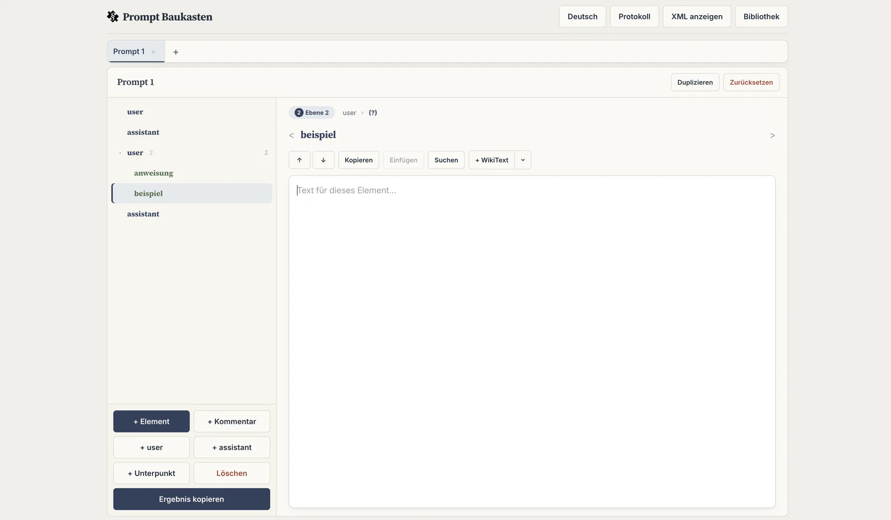
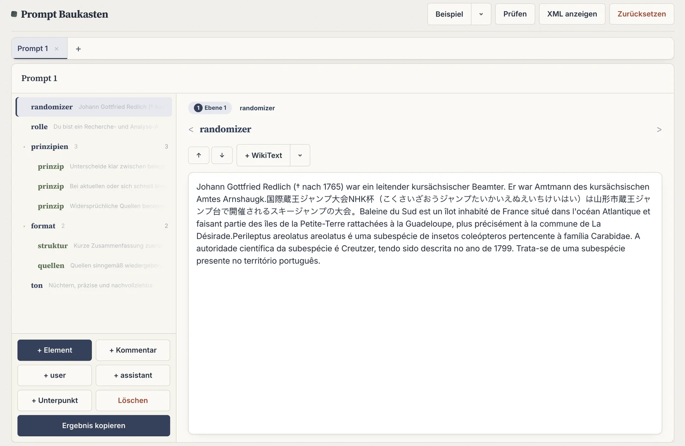
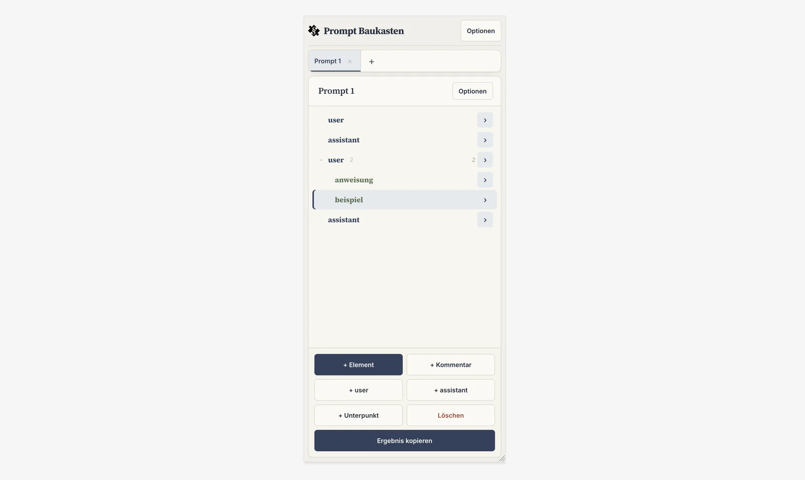

Hier die gesamte finale README auf `.webp`:

# Prompt Baukasten – Strukturierter XML-Editor

<div align="center">

**Visueller Editor für strukturierte LLM-Prompts. Kein Backend. Eine einzige HTML-Datei.**

[Single File](https://img.shields.io/badge/single%20file-HTML-blue?style=flat-square)
[Offline](https://img.shields.io/badge/offline-fähig-75C46B?style=flat-square)
[No Dependencies](https://img.shields.io/badge/dependencies-0-lightgrey?style=flat-square)
[License: MIT](https://img.shields.io/badge/license-MIT-00ACD7?style=flat-square)



</div>

---

### Inhaltsverzeichnis

- [Einleitung](#einleitung)
- [Features](#features)
- [Quickstart](#quickstart)
- [Anwendung](#anwendung)
  - [Tabs & Prompt-Verwaltung](#tabs--prompt-verwaltung)
  - [Struktur-Liste](#struktur-liste)
  - [Detail-Editor](#detail-editor)
  - [XML-Ansicht](#xml-ansicht)
  - [Vorlagen](#vorlagen)
  - [WikiText](#wikitext)
  - [Validierung](#validierung)
  - [Mobile Ansicht](#mobile-ansicht)
  - [URL-Parameter](#url-parameter)
- [Technik](#technik)
- [Browser-Kompatibilität](#browser-kompatibilität)
- [Mitwirken](#mitwirken)
- [Lizenz](#lizenz)

---

## Einleitung

> Ein guter Prompt ist kein Fließtext – er ist Architektur.

**Prompt Baukasten** ist ein rein clientseitiges Web-Tool zum Bauen, Pflegen und Wiederverwenden von strukturierten XML-Prompts für LLMs. Statt XML von Hand zu tippen, arbeitest du in zwei synchronisierten Ansichten: einer hierarchischen Struktur-Liste links und einem fokussierten Editor rechts. Das Ergebnis ist immer sauber serialisiertes, valides XML.

Die gesamte App ist **eine einzige `.html`-Datei**. Keine Installation, kein Build, kein Server, kein Tracking. Doppelklick und los.

Ideal für: System-Prompts, Agenten-Rollen, Few-Shot-Beispiele und jede Art von Prompt, die aus wiederverwendbaren Bausteinen wie `<rolle>`, `<regeln>`, `<beispiele>` besteht.

## Features

- **Visuell statt manuell** – Tags, Texte und Kommentare als interaktive Liste statt rohem XML
- **Beliebige Verschachtelung** – Ebenen-Anzeige mit Badge + Pfad-Navigation, unbegrenzt tief
- **Drag & Drop + Long-Press** – Reihenfolge per Maus verschieben, auf Touch per langem Drücken mit leichtem Vibrieren
- **Multi-Tab Workspace** – Mehrere Prompts parallel, Titel direkt im Kopf der Struktur editierbar, Zustand per URL-Hash teilbar
- **Beidseitiger Sync** – Änderungen in der Liste → sofort im XML, Änderungen im XML-Feld → zurück in die Struktur
- **5 kuratierte Vorlagen** – `Kundenservice (Beispiel)`, `Strukturierter System-Prompt`, `Kundensupport Agent`, `Recherche & Analyse`, `Kreatives Schreiben`
- **Schnellzugriff `+ user` / `+ assistant`** – für Chat-Beispiele
- **WikiText Fülltext** – Zufälliger Wikipedia-Auszug per API, Sprache (de, en, fr, es, it, pt, nl, pl, ru, ja, zh + zufällig) und Länge wählbar, wird direkt an der Cursor-Position eingefügt
- **Prüfung** – Findet leere Tag-Namen und ungültige Schreibweisen, klickbare Fehlerliste springt zur betroffenen Stelle
- **Ampersand-Fix** – Erkennt einzelne `&` und bietet `&amp;`, `und`, `u` oder eigenen Ersatz an
- **Kommentare als eigenes Element** – `<!-- Hinweis -->` wird als 💬 Anmerkung geführt, nicht nur als Text
- **Zeichenzähler** – Zeigt live die Zeichen des Gesamtergebnisses, die Zeichen aller Textfelder und die Auswahl im aktiven Feld
- **Vollständig mobil nutzbar** – Bottom-Sheets, Long-Press, 44px Touch-Ziele, keine Hover-Fallen

## Quickstart

**Variante A – Direkt öffnen:**

```bash
open index.html
```

**Variante B – Lokal hosten (optional):**

```bash
python3 -m http.server 8000
# dann http://localhost:8000/index.html öffnen
```

Keine Abhängigkeiten, kein Build.

## Anwendung

### Tabs & Prompt-Verwaltung

Jeder Tab hält seine eigene Struktur, Auswahl und Zähler. Der Titel wird über das Feld im Kopf der Struktur live geändert – gleiche Logik wie beim Bearbeiten eines Tag-Namens im Detail.

- `+` am Ende der Leiste → neuer Prompt
- `×` am Tab → Tab schließen (letzter Tab wird geleert, nicht gelöscht)

### Struktur-Liste

Links liegt die Übersicht. Sie zeigt Tag-Namen in Serif-Bold, eine kurze Text-Vorschau und die Anzahl der direkt enthaltenen Elemente.

- **Klick** wählt aus
- **Pfeil ▾/▸** klappt den darunterliegenden Bereich auf oder zu
- **Ziehen per Maus** verschiebt innerhalb derselben Ebene
- **Aktionen im Fußbereich:**
  - `+ Element` / `+ Kommentar` – neuen Eintrag auf gleicher Ebene nach dem ausgewählten anlegen
  - `+ user` / `+ assistant` – vorgefertigte Rollen für Beispiele
  - `+ Unterpunkt` / `Löschen` – Ebene tiefer anlegen oder ausgewählten Eintrag entfernen
  - `Ergebnis kopieren` – fertiges `<prompt>...</prompt>` in die Zwischenablage

### Detail-Editor

Rechts erscheint nach Auswahl der eigentliche Editor:

1.  **Ebenen-Leiste:** Anzeige `Ebene N` + Pfad (`rolle › regeln › regel`). Jeder Teil des Pfads ist klickbar.
2.  **Tag-Kopf:** `< [eingabe] >` – Leerzeichen werden automatisch zu `-`
3.  **Werkzeugleiste:** `↑/↓` verschiebt den Eintrag, `+ WikiText` als geteilter Button
4.  **Textfeld:** Eigentlicher Inhalt, füllt den verfügbaren Platz
5.  **Zeichenzähler (wenn aktiv):** Unter dem Textfeld – `Gesamt: X Zeichen | Alle Felder: Y | Auswahl: Z`

Bei Anmerkungen: Kopf `💬 Anmerkung` + kursives Feld.

### XML-Ansicht

Über `XML anzeigen` bzw. `Optionen → XML anzeigen`:

- Desktop: zweispaltig (`1.5fr 1fr`)
- Mobil: eigenes Panel, das von links hereinfährt
- Das Feld zeigt immer die komplette Ausgabe – ein `<prompt>` Rahmen um deine Struktur
- `Übernehmen` liest zurück: Erkennt `<prompt>` als Hülle und übernimmt nur den Inhalt
- `Kopieren` + `„&“ ersetzen…` für den Ampersand-Fix

Ausgabe-Beispiel:

```xml
<prompt>
  <rolle>Du bist ein hilfsbereiter Assistent...</rolle>
  <regeln>
    <regel>Nenne niemals interne Artikelnummern.</regel>
    <!-- Interner Hinweis: pro Mandant anpassen. -->
  </regeln>
</prompt>
```

### Vorlagen

Über `Beispiel ▼` (Desktop) oder `Optionen → Vorlagen` (Mobil):

| Vorlage | Enthält |
| :--- | :--- |
| **Kundenservice (Beispiel)** | rolle, aufgabe, regeln inkl. Anmerkung, beispiele |
| **Strukturierter System-Prompt** | rolle, kernprinzipien, ton, antwortverhalten, grenzen, Ausgewogenheit, Positiv-/Negativ-Beispiele |
| **Kundensupport Agent** | rolle, ziel, ton für ruhig vs. frustriert, Einstufung, Regeln, Beispiel |
| **Recherche & Analyse** | rolle, Grundsätze, Aufbau der Antwort, ton |
| **Kreatives Schreiben** | rolle, ton, Vorgehen in 3 Schritten, Grenzen |

Bestehende Struktur wird nur nach Rückfrage ersetzt.

### WikiText

Der geteilte Button `+ WikiText` besteht aus zwei Teilen:

- **Hauptfläche:** Fügt sofort Text ein
- **Pfeil ▼:** Öffnet Einstellungen für Sprache und `ca. Zeichen` (80–2000)

Quelle ist die Wikipedia API (`generator=random`). `zufällig` wählt aus 11 Sprachen. Eingefügt wird an der aktuellen Cursor-Position im Textfeld.



### Validierung

`Prüfen` läuft über die gesamte Struktur:

- Leerer Tag-Name → `Element ohne Tag-Namen.`
- Entspricht nicht `/^[A-Za-z_][A-Za-z0-9_.\-]*$/` → `„<name>" ungültig.`

Betroffene Zeilen bekommen einen roten Rand links. Ein Banner zeigt `N zu prüfen` mit Liste – Klick springt zur Stelle und markiert sie. Bei 0 Problemen: grünes Banner `Keine Fehler.`

### Mobile Ansicht

Ab ≤900px wechselt die App in den mobilen Modus. Ab ≤480px wird nochmal verdichtet.



**Besonderheiten mobil:**

- **Bottom-Sheets statt Spalten:** Detail-Editor und XML-Ansicht fahren als überlagerte Panels ein. Die Struktur-Liste bleibt im Hintergrund bedienbar und wird abgedunkelt.
- **Long-Press statt Drag:** Langes Drücken (ca. 450ms) aktiviert den Verschiebe-Modus mit leichtem Vibrieren (`navigator.vibrate`).
- **› Öffnen-Button:** In der Listen-Zeile erscheint mobil ein `›` Button, der den Eintrag direkt im Bottom-Sheet öffnet.
- **Kein Hover:** Alle `:hover` Regeln liegen in `@media (hover: hover) and (pointer: fine)`.
- **44px Touch-Ziele:** Buttons und Eingaben haben mindestens 44px Höhe, Pfad-Navigation ist horizontal scrollbar.

### URL-Parameter

Das Layout lässt sich per Hash in der URL steuern und teilen:

```
index.html#tabBarLocation=top&tabBarShown=true&showCharacterCount=false
```

| Parameter | Werte | Standard | Wirkung |
| :--- | :--- | :--- | :--- |
| `tabBarLocation` | `top` / `left` | `top` | Position der Tab-Leiste |
| `tabBarShown` | `true` / `false` | `true` | Tab-Leiste ein- oder ausblenden |
| `showCharacterCount` | `true` / `false` | `false` | Zeichenzähler: Gesamtzeichen Ergebnis + Summe aller Textfelder + aktuelle Auswahl |

Alle Parameter sind optional und kombinierbar.

## Technik

- **Eine Datei:** HTML + CSS + JS in einem Dokument, Favicon als inline SVG Data-URI
- **Zustand:** `tabs[]`, `tree[]`, `idCounter`, `selectedId`, `wikiSettings`, `dragId` – bewusst ohne LocalStorage
- **XML:** `DOMParser` mit `__root__` Hülle + Vorab-Ersetzung einzelner `&`

## Browser-Kompatibilität

Getestet in aktuellen Chromium, Firefox, Safari (Desktop + iOS).

- `fetch` für Wiki (braucht Internet, Rest funktioniert komplett offline)
- `navigator.clipboard.writeText` mit `execCommand('copy')` als Rückfall
- `navigator.vibrate` optional für das Long-Press Feedback

## Mitwirken

Issues und PRs willkommen. Da alles in einer Datei steckt:

1. Fork
2. In der einen HTML-Datei ändern
3. Auf Desktop + Mobil (≤900px und ≤480px) testen
4. PR mit kurzem Screenshot/GIF der Änderung

## Lizenz

MIT – frei für private und kommerzielle Nutzung. Siehe `LICENSE`.
